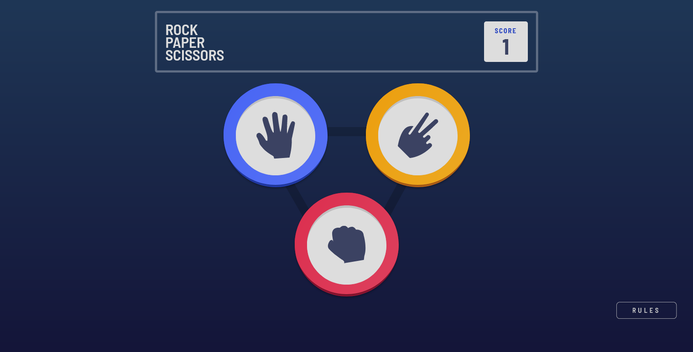

# Frontend Mentor - Rock, Paper, Scissors solution

## The challenge

Users should be able to:

- View the optimal layout for the game depending on their device's screen size
- Play Rock, Paper, Scissors against the computer
- Maintain the state of the score after refreshing the browser _(optional)_
- **Bonus**: Play Rock, Paper, Scissors, Lizard, Spock against the computer _(optional)_

### Screenshot

## My process

### Built with

- Semantic HTML5 markup
- Pures CSS
- Flexbox
- Mobile-first workflow
## Author

Evergardenx
